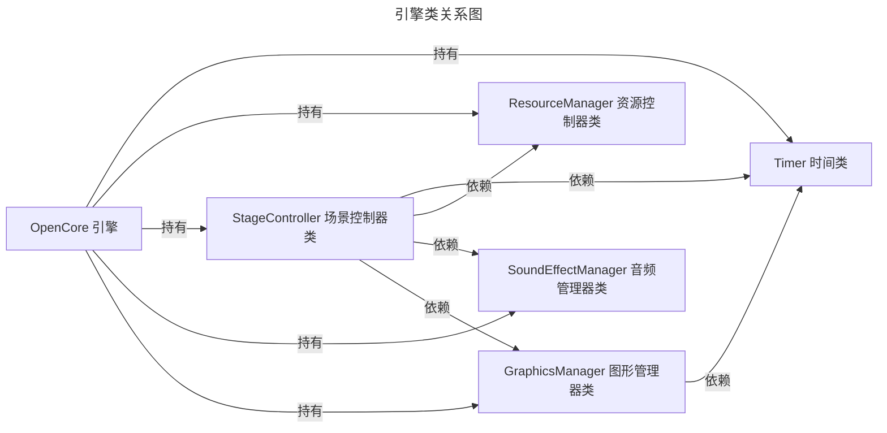
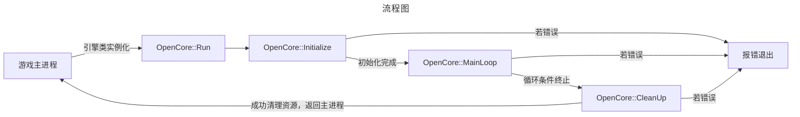

# OpenCore Documentation   开发人员文档

刘绍阳 二零二五年十月十四日

### OpenCore.h 引擎头
---

```mermaid
---
title: 引擎类关系图
---
graph LR
    A[OpenCore 引擎] --> |持有| B[Timer 时间类]
    A[OpenCore 引擎] --> |持有| C[ResourceManager 资源控制器类]
    A[OpenCore 引擎] --> |持有| D[StageController 场景控制器类] --> |依赖| B[Timer 时间类]
    A[OpenCore 引擎] --> |持有| E[SoundEffectManager 音频管理器类] 
    A[OpenCore 引擎] --> |持有| F[GraphicsManager 图形管理器类]--> |依赖| B[Timer 时间类]

    D[StageController 场景控制器类] --> |依赖| C[ResourceManager 资源控制器类]
    D[StageController 场景控制器类] --> |依赖|E[SoundEffectManager 音频管理器类] 
    D[StageController 场景控制器类] --> |依赖|F[GraphicsManager 图形管理器类]
```

```mermaid
---
title: 流程图
---
graph LR
    A[ 游戏主进程 ] --> |引擎类实例化|B[OpenCore::Run]
    B[OpenCore::Run] --> C[OpenCore::Initialize] --> |初始化完成|D[OpenCore::MainLoop] --> |循环条件终止| E[OpenCore::CleanUp]

    C-->|若错误|F
    D-->|若错误|F
    E-->|若错误|F

    E-->|成功清理资源，返回主进程|A

    F[报错退出]


```

<b>核心理念：</b>  
RenderSystem 是整个图形管线的控制中心，负责 FrameBuffer 管理与 DrawCall 分配。

