# OpenCore Documentation <br> 开发人员文档

刘绍阳 二零二五年十月十四日


## 目录
- [OpenCore Documentation  开发人员文档](#opencore-documentation--开发人员文档)
  - [目录](#目录)
    - [OpenCore.h 引擎头](#opencoreh-引擎头)
    - [OpenCore 类详解](#opencore-类详解)
      - [命名空间 OpenCoreManagers](#命名空间-opencoremanagers)
      - [命名空间 Gameplay](#命名空间-gameplay)
      - [OpenEngine 生命周期](#openengine-生命周期)
        - [Public Members](#public-members)
        - [Private Members](#private-members)
        - [Sample](#sample)
    - [GraphicsManager 类详解](#graphicsmanager-类详解)
      - [类定义](#类定义)
        - [Private Members](#private-members-1)
        - [Public Members](#public-members-1)
      - [注意事项](#注意事项)
    - [SoundEffectManager 类详解](#soundeffectmanager-类详解)
      - [类概述](#类概述)
      - [类定义](#类定义-1)
      - [核心功能详解](#核心功能详解)
        - [初始化与销毁](#初始化与销毁)
        - [背景音乐控制](#背景音乐控制)
        - [音效控制](#音效控制)
        - [音量管理](#音量管理)
      - [内部数据结构](#内部数据结构)
        - [私有成员说明](#私有成员说明)
      - [使用示例](#使用示例)
    - [ResourceManager 类详解](#resourcemanager-类详解)
      - [类概述](#类概述-1)
      - [类定义架构](#类定义架构)
      - [核心特性](#核心特性)
        - [资源类型支持](#资源类型支持)
        - [智能内存管理](#智能内存管理)
        - [多线程架构](#多线程架构)
        - [JSON 资源配置](#json-资源配置)
      - [使用示例](#使用示例-1)
      - [设计优势](#设计优势)
    - [Timer 类](#timer-类)
      - [类设计](#类设计)
      - [函数功能详解](#函数功能详解)
        - [`Tick()` 帧点函数](#tick-帧点函数)
        - [`getDeltaTime()` 获取Δ时间](#getdeltatime-获取δ时间)
        - [`getDelayTime()` 获取延迟时间](#getdelaytime-获取延迟时间)
      - [设计原理](#设计原理)
    - [StageController 与 Stage 系统设计](#stagecontroller-与-stage-系统设计)
      - [StageController 场景控制器](#stagecontroller-场景控制器)
        - [类定义概览](#类定义概览)
        - [核心特性](#核心特性-1)
      - [Stage 场景基类](#stage-场景基类)
        - [类定义概览](#类定义概览-1)
        - [场景类型枚举](#场景类型枚举)
      - [系统工作流程](#系统工作流程)
        - [场景切换流程](#场景切换流程)
        - [事件处理流程](#事件处理流程)
        - [渲染流程](#渲染流程)
      - [设计优势](#设计优势-1)
    - [**GFX** Animation 模块](#gfx-animation-模块)
      - [IAnimation 基类](#ianimation-基类)
      - [AnimationPipeline](#animationpipeline)
      - [AnimationManager](#animationmanager)
      - [AnimationState](#animationstate)
      - [Texture 结构体](#texture-结构体)
      - [使用示例](#使用示例-2)
    - [**GFX** UI 控件系统](#gfx-ui-控件系统)
      - [控件手动销毁](#控件手动销毁)
      - [预烘焙纹理 BAKED TEXTURE](#预烘焙纹理-baked-texture)
      - [UIElement 控件定义规范](#uielement-控件定义规范)


### OpenCore.h 引擎头
---

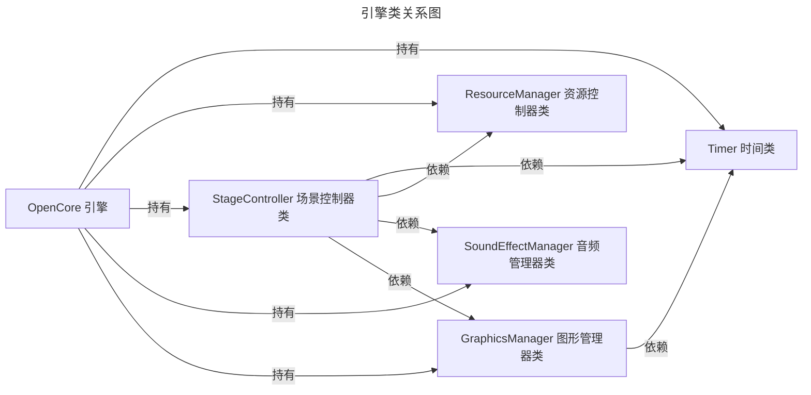


<div style="border-left:4px solid #4CAF50; padding:0.5em 1em; background:#f9fff9;">
<b>注释:</b> <br>
这个依赖关系应该不会变动了。
</div>


### OpenCore 类详解

> 更新于2025/11/25

#### 命名空间 OpenCoreManagers

在此命名空间里，定义并且初始化了三个单例类：`ResourceManager` `GraphicsManager`和 `SoundEffectManager`。这三个类对应了游戏的三大基本模块：资源、图形和声音。

#### 命名空间 Gameplay

这个命名空间是用于储存游戏相关的类并予以初始化。在当前的版本中仅仅含有`MapManager` 和 `ItemManager`，这二者分别用于地图的管理和物品的管理。

#### OpenEngine 生命周期
```C++
class OpenEngine final
{
    public:
    // 单例的获取函数
    static OpenEngine& getInstance();

    bool Run();
    bool Initialize();
    bool MainLoop();
    bool CleanUp();

    private:
    std::unique_ptr<StageController> sController;
    std::unique_ptr<Timer> timer;
};
```

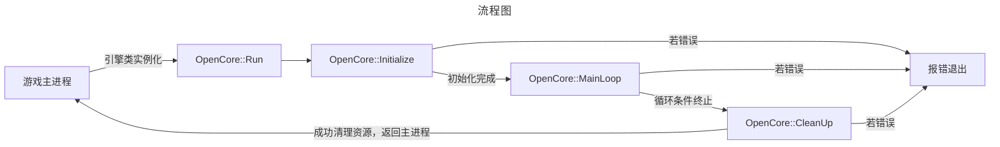

`OpenEngine`类是本引擎的核心模块，其类定义中包含了四个公共方法和两个私有成员。

##### Public Members
+ bool `Run()`
+ bool `Initialize()`
+ bool `MainLoop()`
+ bool `CleanUp()`

这四个基本方法自上而下分别对应了：**①启动引擎的方法**、**②引擎的初始化部分**、**③引擎的主循环部分**、**④引擎的资源回收方法**。他们之间构建的逻辑即为上图所描述的一套完整逻辑。

##### Private Members
+ unique_ptr\<StageController> `sController`
+ unique_ptr\<Timer> `timer`

这二者对应了一个游戏实例所唯一对应的场景管理器，和时间类。

在进行引擎定制的时候，要根据上方流程图来判断代码编辑的具体阶段。

##### Sample

```C++
// #include "OpenCore/OpenCore.h"
// #include <stdexcept>

OpenEngine engine;

try(engine.Run())
{
    return EXIT_SUCESS;
    // 退出成功
} 
catch (exception e) 
{
    return EXIT_FAILURE;
    // 退出失败
}

```

### GraphicsManager 类详解

```C++
class GraphicsManager
{
  public:
    static GraphicsManager &getInstance();
    bool Init();
    void CleanUp();
    ScaleManager *getScale();
    SDL_Window *getWindow();
    SDL_Renderer *getRenderer();
    int RenderCopyEx(....);
    int RenderCopy(....);
    int setOffScreenRender(SDL_Texture *texture);
    SDL_Texture *createTexture(uint16_t w, uint16_t h);
    void setScale(uint16_t w, uint16_t h);
  private:
    SDL_Window *window;
    SDL_Renderer *renderer;

    std::unique_ptr<ScaleManager> ContentScale;
};
```

本类并没有自己的内部并行逻辑，属于完全用于调用的类。

其中
#### 类定义

##### Private Members
+ SDL_Window* `Window`
+ SDL_Renderer* `renderer`
+ unique_ptr<...> `ContentScale`

自上而下，依次是 **SDL所创建的窗口的指针**、**SDL对于窗口所创建的对应的渲染器的指针**、**游戏引擎中的尺寸管理器**，他们都在初始化的时候被赋值。

##### Public Members

这些公共方法的具体对应功能可以通过方法名称来进行直接的判断。

#### 注意事项

由于资源类`ResourceManager`的初始化需要使用到SDL的相关部分，而SDL的初始化是在本类中进行的，这意味着你必须在初始化资源类之前优先初始化本类（单例的声明无需考虑这一点，因为声明和初始化的发生是分离的）


### SoundEffectManager 类详解

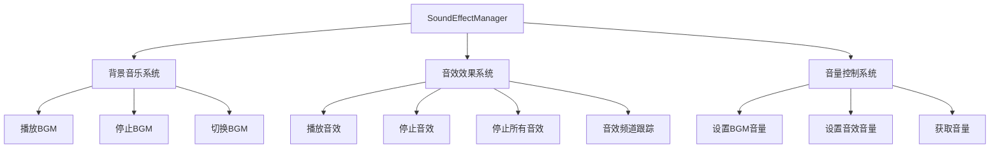

#### 类概述

SoundEffectManager 是 OpenCore 引擎的音频管理模块，负责处理游戏中的背景音乐和音效播放。采用单例模式设计，确保全局音频状态的一致性。

#### 类定义

```cpp
class SoundEffectManager {
public:
    static SoundEffectManager& getInstance();
    bool Init(ResourceManager* resManager);
    void CleanUp();
    
    void playBGM();
    void stopBGM();
    bool changeBGM(short id);
    
    void playSE(int id, int loops = 0);
    void stopSE(int id);
    void stopAllSE();
    
    void setVolume(int volume);
    void setSEVolume(int id, int volume);
    void setAllSEVolume(int volume);
    int getVolume() const;
    
    bool loadBGM(int id);

private:
    Mix_Music* bgm = nullptr;
    int volume = 128;
    std::map<int, Mix_Chunk*> soundEffectRefs;
    std::map<int, std::vector<int>> playingChannels;
    ResourceManager* resourceManager;

    SoundEffectManager() = default;
    ~SoundEffectManager() = default;
    SoundEffectManager(const SoundEffectManager&) = delete;
    SoundEffectManager& operator=(const SoundEffectManager&) = delete;
};
```

#### 核心功能详解

##### 初始化与销毁
- `Init(ResourceManager* resManager)`: 手动初始化，需要传入资源管理器指针
- `CleanUp()`: 手动清理所有音频资源

##### 背景音乐控制
- `playBGM()`: 播放当前加载的背景音乐
- `stopBGM()`: 停止背景音乐播放
- `changeBGM(short id)`: 切换背景音乐曲目
- `loadBGM(int id)`: 从资源系统加载指定ID的背景音乐

##### 音效控制
- `playSE(int id, int loops)`: 播放音效，支持循环播放
- `stopSE(int id)`: 停止特定音效的所有播放实例
- `stopAllSE()`: 停止所有正在播放的音效

##### 音量管理
- `setVolume(int volume)`: 设置背景音乐音量（0-128）
- `setSEVolume(int id, int volume)`: 设置特定音效的音量
- `setAllSEVolume(int volume)`: 批量设置所有音效音量
- `getVolume()`: 获取当前背景音乐音量

#### 内部数据结构

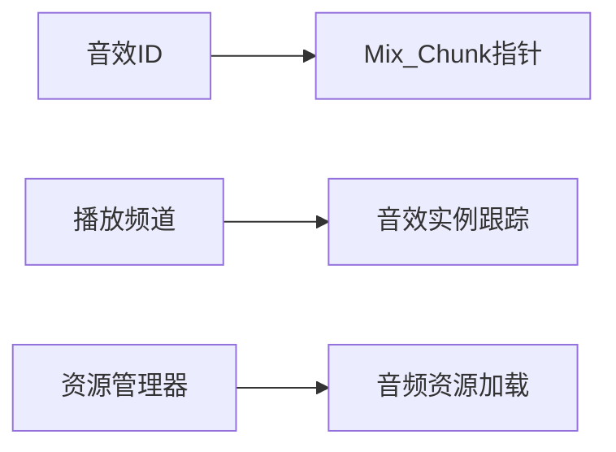

##### 私有成员说明
- `bgm`: 当前背景音乐指针
- `volume`: 背景音乐音量值，范围0-128
- `soundEffectRefs`: 音效ID到音频数据的映射
- `playingChannels`: 跟踪每个音效ID正在使用的播放频道
- `resourceManager`: 资源管理器引用，用于音频资源加载

<div style="border-left:4px solid #FF9800; padding:0.5em 1em; background:#fffaf0;">
<b>设计特点：</b><br>
1. 采用引用计数的音效管理，避免重复加载<br>
2. 精确的音效实例跟踪，支持单独停止特定音效<br>
3. 与资源管理器深度集成，统一资源生命周期管理<br>
4. 完整的音量控制体系，支持单独和批量设置
</div>

#### 使用示例

```cpp
// 初始化音频系统
SoundEffectManager::getInstance().Init(&resourceManager);

// 播放背景音乐
SoundEffectManager::getInstance().changeBGM(1001);
SoundEffectManager::getInstance().playBGM();

// 播放音效
SoundEffectManager::getInstance().playSE(2001); // 播放一次
SoundEffectManager::getInstance().playSE(2002, -1); // 循环播放

// 音量控制
SoundEffectManager::getInstance().setVolume(80);
SoundEffectManager::getInstance().setSEVolume(2001, 100);
```


### ResourceManager 类详解

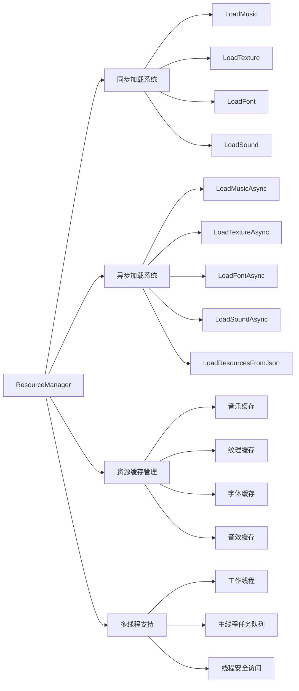

#### 类概述

ResourceManager 是 OpenCore 引擎的核心资源管理模块，采用单例模式设计，负责统一管理游戏中的所有资源（音乐、纹理、字体、音效）。支持同步和异步加载机制，内置多线程支持和资源缓存。

#### 类定义架构

```cpp
class ResourceManager {
public:
    static ResourceManager &getInstance();
    bool Init();
    void CleanUp();

    // 同步资源加载
    void LoadMusic(short id, const std::string &path);
    void LoadSound(short id, const std::string &path);
    void LoadTexture(short id, const std::string &path);
    void LoadFont(short id, const std::string &path, int size);

    // 资源获取接口
    Mix_Music *GetMusic(short id);
    Mix_Chunk *GetSound(short id);
    std::shared_ptr<SDL_Texture> GetTexture(short id);
    TTF_Font *GetFont(short id);

    // 异步资源加载
    std::future<void> LoadMusicAsync(short id, const std::string &path);
    std::future<void> LoadTextureAsync(short id, const std::string &path);
    std::future<void> LoadFontAsync(short id, const std::string &path, int size);
    std::future<void> LoadSoundAsync(short id, const std::string &path);
    std::future<void> LoadResourcesFromJson(short id);

    // 资源释放管理
    void FreeMusic(short id);
    void FreeTexture(short id);
    void FreeFont(short id);
    void FreeSound(short id);
    void ClearAll();

    // 异步资源释放
    std::future<void> FreeMusicAsync(short id);
    std::future<void> FreeTextureAsync(short id);
    std::future<void> FreeFontAsync(short id);
    std::future<void> FreeSoundAsync(short id);

    // 主线程任务处理
    void ProcessMainThreadTasks();

private:
    // 多线程支持
    void StartWorker();
    void StopWorker();
    template <typename F>
    std::future<void> EnqueueTask(F &&f);

    // 资源缓存系统
    std::unordered_map<short, MusicPtr> musicCache_;
    std::unordered_map<short, SoundPtr> soundCache_;
    std::unordered_map<short, TexturePtr> textureCache_;
    std::unordered_map<short, FontPtr> fontCache_;

    // 线程同步机制
    std::mutex musicMutex_, soundMutex_, textureMutex_, fontMutex_;
    std::mutex queueMutex_, mainThreadQueueMutex_;
    std::condition_variable queueCV_;
    std::queue<std::function<void()>> taskQueue_, mainThreadTaskQueue_;
    std::thread worker_;
    std::atomic<int> activeTasks_{0};
    std::atomic<bool> shouldStop_{false};
};
```

#### 核心特性

##### 资源类型支持
- **音乐资源**: Mix_Music 对象，用于背景音乐
- **音效资源**: Mix_Chunk 对象，用于短音效
- **纹理资源**: SDL_Texture 对象，用于图形渲染
- **字体资源**: TTF_Font 对象，用于文本渲染

##### 智能内存管理
```cpp
struct SDLDeleter {
    void operator()(Mix_Music *music) const;
    void operator()(SDL_Texture *texture) const;
    void operator()(TTF_Font *font) const;
    void operator()(Mix_Chunk *chunk) const;
};
```
使用自定义删除器确保 SDL 资源的正确释放，避免内存泄漏。

##### 多线程架构

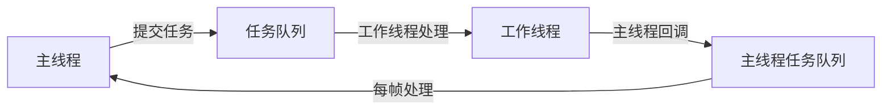

- **异步加载**: 所有资源类型支持异步加载，不阻塞主线程
- **线程安全**: 使用互斥锁保护所有资源缓存访问
- **任务队列**: 基于条件变量的生产者-消费者模式

##### JSON 资源配置
支持通过 JSON 文件批量加载场景资源，简化资源管理流程。

#### 使用示例

```cpp
// 初始化资源管理器
ResourceManager::getInstance().Init();

// 同步加载纹理
ResourceManager::getInstance().LoadTexture(1001, "assets/player.png");
auto texture = ResourceManager::getInstance().GetTexture(1001);

// 异步加载音乐
auto future = ResourceManager::getInstance().LoadMusicAsync(2001, "assets/bgm.ogg");
future.wait(); // 等待加载完成

// 批量JSON加载
ResourceManager::getInstance().LoadResourcesFromJson(1);

// 每帧处理主线程任务
ResourceManager::getInstance().ProcessMainThreadTasks();
```

#### 设计优势

1. **统一的资源生命周期管理**
2. **零拷贝资源获取**，返回原始指针或共享指针
3. **完全线程安全**的资源访问
4. **灵活的加载策略**，支持同步和异步模式
5. **自动内存回收**，通过智能指针和自定义删除器
6. **可扩展的架构**，易于添加新的资源类型

### Timer 类

#### 类设计

```cpp
class Timer
{
public:
    void Tick();
    double getDeltaTime();
    float getDelayTime();

private:
    std::chrono::high_resolution_clock::time_point lastTime;
    float deltaTime = 0.0f;
    float frameLimit = 0.033f;    
};
```

以上即为Timer类的结构，包含三个公有成员：`Tick()`、`getDeltaTime()`、`getDelayTime()`，接下来从各功能进行详细说明。

#### 函数功能详解

##### `Tick()` 帧点函数
此函数每帧执行一次，主要功能包括：
- 计算当前帧与上一帧的时间间隔
- 记录当前时间点，为下一帧计算提供基准
- 基于chrono高精度时钟实现精确时间测量

##### `getDeltaTime()` 获取Δ时间
- 返回上一帧到当前帧的时间间隔（秒）
- 数据来源于`Tick()`计算后存储的deltaTime私有成员
- 确保返回值为非负，避免逻辑错误

##### `getDelayTime()` 获取延迟时间
实现固定帧率控制的核心机制：
- 计算达到目标帧率所需的剩余时间
- 以30Hz为例：固定帧时长 = 1/30 ≈ 0.033秒（33ms）
- 工作流程：
  - 若当前帧执行时间未达目标时长，则等待剩余时间
  - 若已超时，则立即进入下一帧（跳帧处理）
- 前提假设：大多数情况下帧处理时间短于目标时长，避免频繁溢出

#### 设计原理

该时间系统通过精确的时间测量和延迟控制，为游戏引擎提供稳定的时间基准，确保物理模拟、动画更新等时间敏感操作的准确性，同时支持可配置的帧率限制功能。

### StageController 与 Stage 系统设计

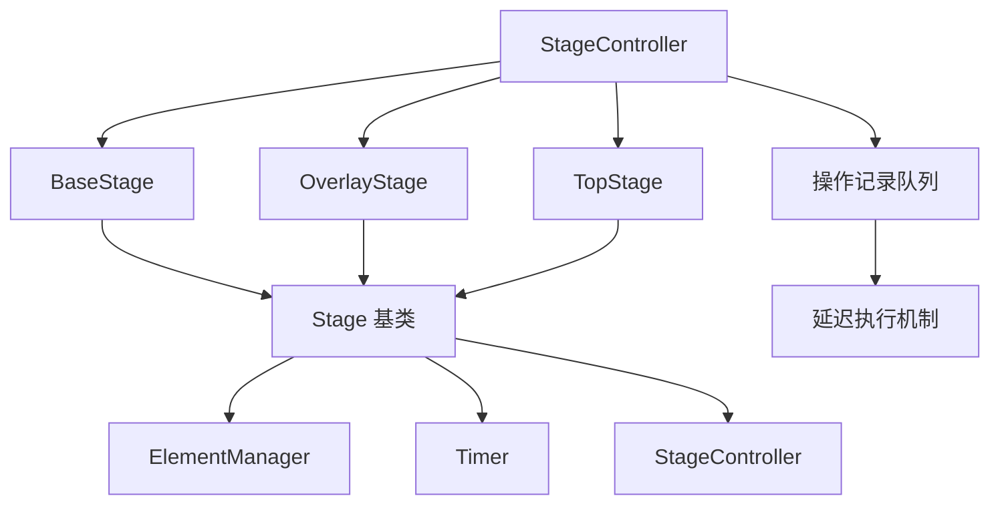

#### StageController 场景控制器

##### 类定义概览

```cpp
class StageController {
public:
    ~StageController() = default;
    
    // 场景管理接口
    void changeStage(unique_ptr<Stage> newStage);
    void removeStage(StageType sType);
    
    // 主循环接口
    bool handlEvents(SDL_Event *event);
    void onUpdate();
    void onRender();
    
    // 场景访问接口
    BaseStage* getBaseStage() const;
    OverlayStage* getOverlayStage() const;
    TopStage* getTopStage() const;
    
    // 场景存在性检查
    bool hasBaseStage() const;
    bool hasOverlayStage() const;
    bool hasTopStage() const;

private:
    std::array<unique_ptr<Stage>, 3> stageContainer; // [0]:base, [1]:overlay, [2]:top
    std::queue<unique_ptr<OperateRecord>> StreamLine;
};
```

##### 核心特性

**三层场景容器**
- **BaseStage**: 基础场景层，通常用于主游戏场景
- **OverlayStage**: 覆盖场景层，用于UI、菜单等覆盖元素
- **TopStage**: 顶层场景层，用于对话框、提示等最高层级

**延迟操作机制**
```cpp
struct OperateRecord {
    Operation opt;  // Add 或 Remove
    StageType sType;
    unique_ptr<Stage> stage_;
};
```
通过操作记录队列实现场景切换的延迟执行，确保在合适的时机进行场景变更。

#### Stage 场景基类

##### 类定义概览

```cpp
class Stage {
public:
    virtual ~Stage() { onDestroy(); }
    
    // 纯虚函数 - 必须由派生类实现
    virtual bool handlEvents(SDL_Event *event) = 0;
    virtual void onUpdate() = 0;
    virtual void onRender() = 0;
    
    // 虚函数 - 可选择重写
    virtual void onDestroy();
    
    // 场景类型管理
    StageType getStageType() const;
    void setStageType(StageType stageType);
    
    // 元素传输
    bool transferElementTo(Stage *destStage, const std::string &id);
    bool transferElementFrom(Stage *srcStage, const std::string &id);
    
    // 元素管理器访问
    ElementManager *getElementManager() const;

protected:
    Timer *timer = nullptr;
    StageController *sController;
    StageType stageType = unregistered;
    std::unique_ptr<ElementManager> Elements;
};
```

##### 场景类型枚举

```cpp
enum StageType : uint8_t {
    baseStage,      // 基础场景
    overlayStage,   // 覆盖场景  
    topStage,       // 顶层场景
    unregistered    // 未注册状态
};

enum LifeStatus {
    alive,          // 活跃状态
    pause,          // 暂停状态
    died            // 销毁状态
};
```

#### 系统工作流程

##### 场景切换流程
```cpp
// 创建新场景
auto newStage = std::make_unique<MyBaseStage>();
stageController.changeStage(std::move(newStage));

// 在onUpdate()中实际执行切换
void StageController::onUpdate() {
    ParsingStreamLine(); // 解析并执行所有待处理操作
    // ... 更新各场景逻辑
}
```

##### 事件处理流程
```cpp
bool StageController::handlEvents(SDL_Event *event) {
    // 从顶层到底层的优先级处理
    if (hasTopStage() && getTopStage()->handlEvents(event)) return true;
    if (hasOverlayStage() && getOverlayStage()->handlEvents(event)) return true;
    if (hasBaseStage() && getBaseStage()->handlEvents(event)) return true;
    return false;
}
```

##### 渲染流程
```cpp
void StageController::onRender() {
    // 从底层到顶层的渲染顺序
    if (hasBaseStage()) getBaseStage()->onRender();
    if (hasOverlayStage()) getOverlayStage()->onRender();
    if (hasTopStage()) getTopStage()->onRender();
}
```

#### 设计优势

1. **分层管理**: 三层场景结构清晰分离不同逻辑层级
2. **延迟操作**: 避免在事件处理或渲染过程中直接修改场景状态
3. **元素传输**: 支持场景间UI元素的动态迁移
4. **类型安全**: 通过枚举和动态转换确保场景类型正确性
5. **资源管理**: 统一的初始化和销毁生命周期管理

该场景管理系统为游戏提供了灵活的场景组织和切换机制，支持复杂的UI层级关系和场景间交互。

### **GFX** Animation 模块

动画是游戏不可或缺的元素，同样的，动画系统的设计也是游戏开发无法逃避的内容。

本引擎中，动画系统主要涉及到以下这些类：
+ `IAnimation` 所有动画的基类
+ `AnimationPipeline` 动画声明管线
+ `AnimationManager` 动画管理器
+ `AnimationState` 动画状态

它们之间的关系如下图:

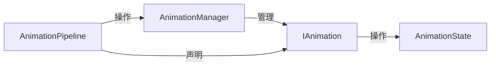

#### IAnimation 基类

```cpp
class IAnimation
{
public:
    virtual ~IAnimation() = default;
    void setName(const std::string& n) { name = n; }
    const std::string& getName() const { return name; }
    virtual void onUpdate(float totalTime, AnimationState& state) = 0;
    virtual bool isFinished() const = 0;
    virtual void reset(float totalTime, AnimationState& state) = 0;
    virtual bool isLoop() = 0;
private:
    std::string name;
};
```

基类中的定义表明，所有的动画都应该有他们的名称标识符，并且要有一个明确的结束状态，带有重置方法，以及对于是否循环的判定。当然还有最重要的动画更新逻辑。

#### AnimationPipeline

由于具体项目将继承该类派生出的`MyAnimationPipeline`，在此处只对其的用法做一个阐述：

```cpp
// 定义一个元素
auto element = UI<FrameCounter>(....);

// 链式定义动画
// Animate()方法返回的是一个AnimationPipeline指针
element->Animate().Scale(0.5f,1.0f,2.0f).Move(-100,-100,100,100,5.0f).Commit();
```

#### AnimationManager

```cpp
class AnimationManager
{
public:
    void onUpdate(float totalTime, AnimationState& state);
    void pushAnimation(std::shared_ptr<IAnimation> anime);
    void eraseAnimation(std::shared_ptr<IAnimation> anime);
    bool isEmpty() const { return Animations.empty(); }
    void clear();
    bool hasAnimation() const { return !Animations.empty(); }
    void setSequence(bool isSequential);
    bool isFinished() const;

private:
    std::vector<std::shared_ptr<IAnimation>> Animations;
    bool sequential = false;
};
```

动画管理器负责管理和更新所有动画实例，支持两种执行模式：
- **并行执行**（默认）：所有动画同时进行
- **顺序执行**：动画按添加顺序依次执行

#### AnimationState

```cpp
struct AnimationState
{
    // 帧容量和帧索引
    uint8_t frameCapacity = 0;
    uint8_t frameIndex = 0;

    // 不透明度
    float transparency = 1.0f;
    
    // 尺寸缩放（X轴，Y轴）
    float scale[2] {1.0f, 1.0f};

    // 旋转角度
    float angle = 0.0f;

    // 位置坐标
    int16_t Position[2] {0,0};

    // 锚点
    AnchorPoint Anchor = AnchorPoint::Center;    
};
```

动画状态结构体封装了所有可动画化的属性，包括：
- **帧动画**相关的容量和索引
- **透明度**控制
- **缩放**变换（支持非均匀缩放）
- **旋转**角度
- **位置**坐标
- **锚点**设置

#### Texture 结构体

```cpp
struct Texture
{
    uint8_t xCount = 1;
    uint8_t yCount = 1;
    uint16_t width, height;
    std::shared_ptr<SDL_Texture> texture;

    Texture(uint8_t x, uint8_t y, std::shared_ptr<SDL_Texture> tex);
    uint16_t Size() const noexcept { return xCount * yCount; }
    SDL_Rect getSrcRect(uint8_t index);    
};
```

Texture 结构体支持精灵图集，通过行列计数将单张纹理分割为多个帧，便于帧动画的实现。

#### 使用示例

```cpp
// 创建动画管理器
AnimationManager animManager;

// 设置顺序执行模式
animManager.setSequence(true);

// 添加动画
animManager.pushAnimation(std::make_shared<MoveAnimation>(...));
animManager.pushAnimation(std::make_shared<FadeAnimation>(...));

// 更新动画
AnimationState state;
animManager.onUpdate(deltaTime, state);

// 检查完成状态
if (animManager.isFinished()) {
    // 动画序列完成
}
```

### **GFX** UI 控件系统

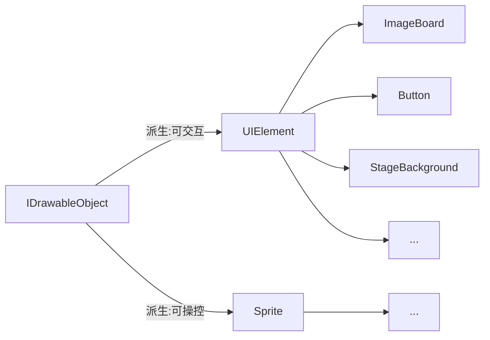

声明一个UI控件最简单的方法就是:
```C++
auto imageBorad = UI<ImageBoard>("StartTitle", 0, 2001, 1, 1);
```


#### 控件手动销毁
在`OpenCore 25.1 Eclipse`版本中，加入了对于控件手动销毁的支持，现在可以完全释放控件所对应的`Texture`纹理和对象本身，仅需：

```C++
ElementManager.destroy("Title1");
```

但我们不建议频繁的销毁控件，和设计一些生命周期极短的控件。能够共享使用的控件尽量共享以避免频繁的内存操作。


#### 预烘焙纹理 BAKED TEXTURE
该特性在`OpenCore 25.1 Eclipse`加入，允许部分UI控件使用预烘焙的纹理而并非实时渲染。


以stageBackground控件举例，作为界面的背景板控件，该背景所对应的纹理实际上是一个服从3x3布局的通用纹理，因而在实际渲染中需要进行计算来贴合实际的大小和比例。

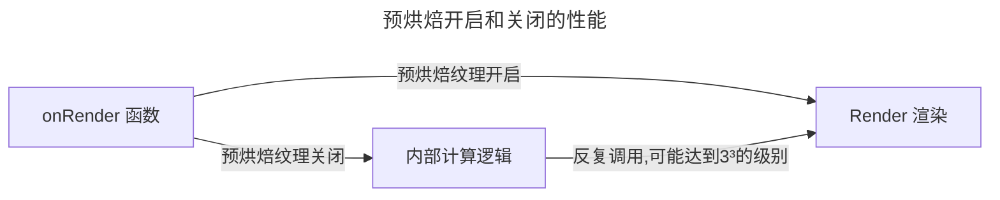

但绝大多数情况下，该控件的大小一旦初始化之后便不会改变。因而每帧去计算输出纹理，加上反复的绘制，实际上是对性能极大的浪费。为了解决这个问题，OpenCore引入了预编译纹理的理念。

在初始化之后，可以根据实际大小来预编译一次纹理，自此与外部纹理解耦合，并将预先编译的纹理存入内存之中，而后每一帧直接调用该纹理即可。

```C++
auto stageBG = UI<StageBackground>("board", -1, 2001, 3, 3);
// 声明
stageBG->setNativeScale(60);
// 设置正方形角的原生尺寸（相对于1920x1080而言）
stageBG->setBakedTexture(true);
// 启用预编译纹理
```

在调用`setBakedTexture()`参数之后，控件的预烘焙属性被打开（这个属性默认关闭）。

| 方法 | CPU延迟 | GPU延迟 | 总延迟 | 渲染调用次数 |
| ---- | ---- | ---- | ---- | ---- |
| 预烘焙纹理 | 0.1ms | 0.5ms | 0.6ms | 1 |
| 实时计算渲染纹理 | 2ms | 1ms | 3ms | 9 |

>该方法基于`FHD分辨率(1920x1080)`下，渲染九宫格纹理实机测试得出。

这个新的特性将为支持预烘焙的控件带来高达 **400%** 的性能提升。

但在现阶段仍然存在一些问题，`OpenCore 25.1`版本将预烘焙视作UI控件的基础特性，但是对于预烘焙的时机仍然不明——预烘焙在此版本运行在主线程，会阻塞游戏进行，暂且没有等待机制。

> 2025.10.18 OpenCore 25.1.18 现已支持预渲染贴图的重新绘制。

#### UIElement 控件定义规范

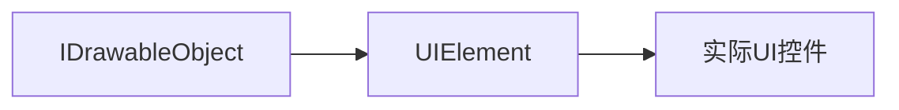

`UIElement`是继承自IDrawableObject的抽象类，在此之上派生出实际的UI控件类。我们在此，将所有派生自UIElement的类称作UI类。

UI类的定义，需要遵循以下的规范：
+ `onRender()`必须得到实现：<br>这一点尤为重要，由于**预渲染贴图BakedTexture**的加入，我们更改了一般的UIElement的渲染管线，基类中就已经加入了关于预渲染的开关，在基类中给出了onRender的默认实现。实际的UI类在定义时必须重写该方法来确定实际的渲染方法。
+ `onDestroy()`必须得到实现:<br>我们虽然在基类中给出了该方法的默认实现，但是对于实际的控件我们仍然要求再度实现这个方法，因为基类中的默认实现只销毁了纹理。对于实际的控件来说，我们经常会处理到那些存在**子控件**的控件，所以我们必须在特定的控件中重写销毁方法以销毁那些额外加入的内容。
+ `preRenderTexture()`必须得到实现：<br>基类中已经对该方法进行了默认实现，即返回false，对于需要预渲染的控件来说，在此方法中重写以适配。