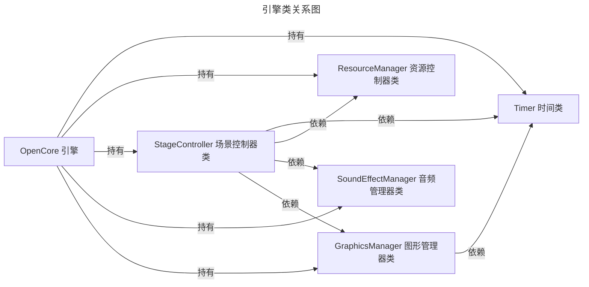
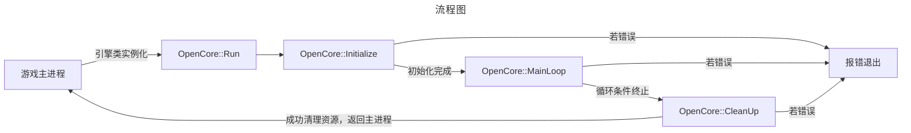
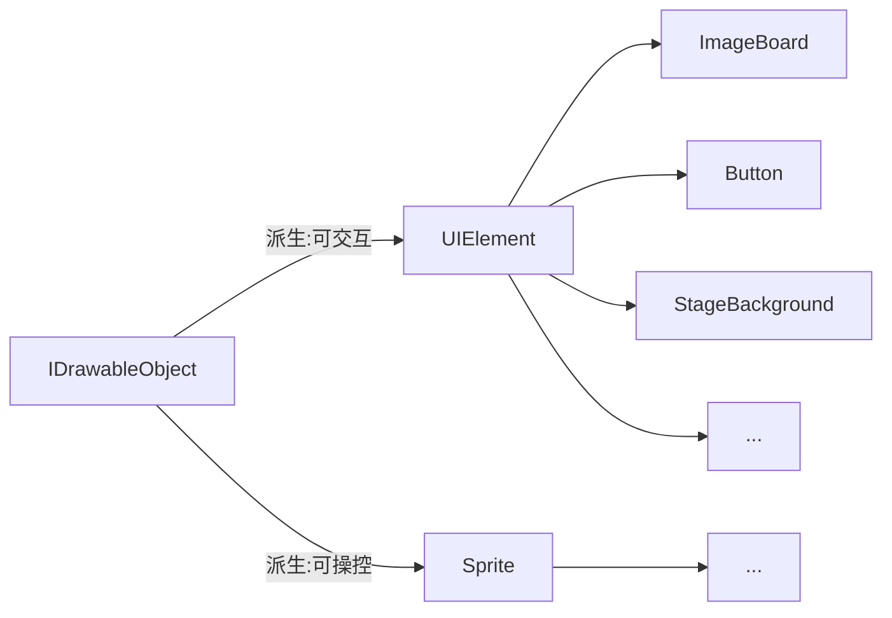
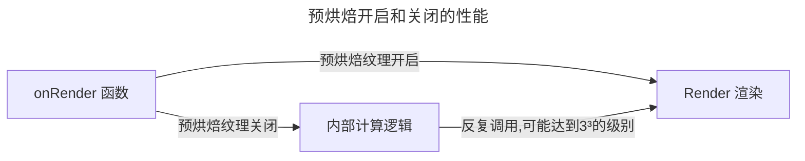

# OpenCore Documentation <br> 开发人员文档

刘绍阳 二零二五年十月十四日


## 目录
- [OpenCore 引擎结构叙述](#opencoreh-引擎头)
- [UI 控件系统](#ui-控件系统)
- [控件手动销毁](#控件手动销毁)
- [预烘焙纹理特性](#预烘焙纹理-baked-texture)


### OpenCore.h 引擎头
---







<div style="border-left:4px solid #4CAF50; padding:0.5em 1em; background:#f9fff9;">
<b>核心理念：</b> <br>
内核/引擎的设计必须坚持模块化的初衷。各模块之间的高内聚，低耦合是代码优化之后的硬性要求。属于Graphics部分的渲染功能，应该专由GraphicsManager实现，而不应该由模块内部自行调用实现——后者可以实现，但是会大大影响绘制管线的一致性。
</div>


### UI 控件系统



声明一个UI控件最简单的方法就是:
```C++
auto imageBorad = UI<ImageBoard>("StartTitle", 0, 2001, 1, 1);
```


#### 控件手动销毁
在`OpenCore 25.1 Eclipse`版本中，加入了对于控件手动销毁的支持，现在可以完全释放控件所对应的`Texture`纹理和对象本身，仅需：

```C++
ElementManager.destroy("Title1");
```

但我们不建议频繁的销毁控件，和设计一些生命周期极短的控件。能够共享使用的控件尽量共享以避免频繁的内存操作。


#### 预烘焙纹理 BAKED TEXTURE
该特性在`OpenCore 25.1 Eclipse`加入，允许部分UI控件使用预烘焙的纹理而并非实时渲染。


以stageBackground控件举例，作为界面的背景板控件，该背景所对应的纹理实际上是一个服从3x3布局的通用纹理，因而在实际渲染中需要进行计算来贴合实际的大小和比例。



但绝大多数情况下，该控件的大小一旦初始化之后便不会改变。因而每帧去计算输出纹理，加上反复的绘制，实际上是对性能极大的浪费。为了解决这个问题，OpenCore引入了预编译纹理的理念。

在初始化之后，可以根据实际大小来预编译一次纹理，自此与外部纹理解耦合，并将预先编译的纹理存入内存之中，而后每一帧直接调用该纹理即可。

```C++
auto stageBG = UI<StageBackground>("board", -1, 2001, 3, 3);
// 声明
stageBG->setNativeScale(60);
// 设置正方形角的原生尺寸（相对于1920x1080而言）
stageBG->setBakedTexture(true);
// 启用预编译纹理
```

在调用`setBakedTexture()`参数之后，控件的预烘焙属性被打开（这个属性默认关闭）。

| 方法 | CPU延迟 | GPU延迟 | 总延迟 | 渲染调用次数 |
| ---- | ---- | ---- | ---- | ---- |
| 预烘焙纹理 | 0.1ms | 0.5ms | 0.6ms | 1 |
| 实时计算渲染纹理 | 2ms | 1ms | 3ms | 9 |

>该方法基于`FHD分辨率(1920x1080)`下，渲染九宫格纹理实机测试得出。

这个新的特性将为支持预烘焙的控件带来高达 **400%** 的性能提升。

但在现阶段仍然存在一些问题，`OpenCore 25.1`版本将预烘焙视作UI控件的基础特性，但是对于预烘焙的时机仍然不明——预烘焙在此版本运行在主线程，会阻塞游戏进行，暂且没有等待机制。